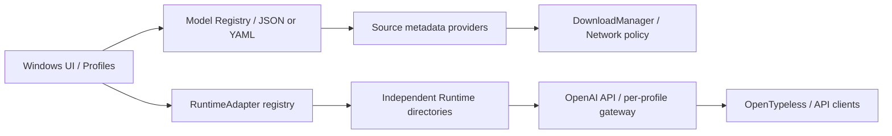

# Model / Runtime 架构（0.3.0）

[中文说明](#边界) · [English summary](#english-summary)

## 边界

Local Model Manager 管理模型来源、下载、推理引擎、进程与 API。推理由独立 Runtime 执行，应用不实现 CUDA 算子，不内置聊天产品。



| 模块 | 职责 |
| --- | --- |
| `lmm/registry.py`、`assets/model_registry.json` | Manifest 校验、文件角色、兼容证据和推荐 |
| `lmm/adapters.py` | Runtime 接口、发行资产解析、阶段验证、启动参数、能力与协议差异 |
| `lmm/runtime.py` | 通用下载、安装事务、按 Runtime 隔离备份和回滚 |
| `lmm/sources.py`、`lmm/models.py` | HF、GitHub Release、普通 URL、本地模型元数据及索引 |
| `lmm/net.py`、`lmm/network.py` | 统一下载器与代理策略；不使用 HF SDK 下载 |
| `lmm/processes.py` | 独立监督器、准确的进程身份、启停和日志 |
| `lmm/api.py`、`lmm/proxy.py` | 就绪检查、OpenAI 请求、可选的单 Profile API Gateway |
| `lmm/transcribe_service.py` | 调用上游 ctypes binding 的轻量 OpenAI ASR 桥接 |

## Runtime 状态

| Adapter ID | 状态 | 本阶段范围 |
| --- | --- | --- |
| `llama_cpp` | 已实现 | CUDA Runtime 安装、启动、监控；已有 Qwen3-ASR 流程保留 |
| `audio_cpp` | 已实现 | 官方 Windows CUDA 发行包；ASR / TTS 能力声明；实测 Fun-ASR Nano ASR |
| `transcribe_cpp` | 已实现 | 官方 binding/native wheel、独立 CUDA 依赖、OpenAI ASR 桥接；实测 handy Fun-ASR |
| `faster_whisper` | 接口预留 | 未实现安装、启动；界面明确标为预留 |
| `ollama` | 接口预留 | 同上 |
| `lm_studio` | 接口预留 | 同上 |
| `vllm` | 接口预留 | 同上 |
| `nvidia_nim` | 接口预留 | 同上 |

任务类型支持 `asr`、`llm`、`embedding`、`vision`、`reranker`、`tts`。能力声明不保证任意模型或任意版本都兼容，也不表示所有任务均已实机验收。

Adapter 提供 `id`、`supported_tasks`、`detect_compatibility`、`install_runtime`、`check_update`、`build_launch_command`、`start`、`stop`、`health_check`、`get_model_id`、`expose_capabilities`。安装流程另调用 `resolve_release` / `verify_stage` 扩展点。新增引擎实现 Adapter 并通过 `register_adapter()` 注册；模型识别和通用安装事务不需要新增引擎分支。应用没有加载任意用户 Python 插件的入口。

Runtime 目录独立：`runtime/llama.cpp`、`runtime/audio_cpp`、`runtime/transcribe_cpp`。配置中的 `runtime_paths` 可以给后两者指定外部路径；既有 `runtime_dir` 保持 llama.cpp 的原语义。更新一个 Runtime 只重启使用该 Runtime 的受管服务。

## 新增模型 = 新增 Manifest

内置目录随应用更新；「模型库 → 导入模型清单」接受 UTF-8 YAML / JSON，并保存到 `config/manifests/`。相同 ID 的用户清单覆盖内置项。YAML 使用 safe loader；不支持脚本、命令或安装钩子。

参见可直接导入的 [Fun-ASR 示例](examples/fun-asr-nano.yaml)：

```yaml
id: fun-asr-nano-2512
name: Fun-ASR Nano 2512 Q8_0
task: asr
source:
  type: huggingface
  repo: FunAudioLLM/Fun-ASR-Nano-2512-GGUF
runtime:
  recommended: audio_cpp
  options:
    family: fun_asr_nano
files:
  model:
    pattern: "*q8_0.gguf"
api:
  protocol: openai
  endpoint: /v1/audio/transcriptions
```

`family` 是 audio.cpp 的模型族配置，不是管理器中的模型名称判断。如果上游已经支持新模型族，只需改清单；若上游尚不支持，Manifest 不能替代引擎实现。每个文件角色必须匹配唯一文件，歧义会报错，避免下载错误量化版本。配套文件可增加 `mmproj` 等角色；Profile 保存文件角色、Manifest ID、Runtime ID 和 runtime options。

`source.type` 支持 `huggingface`（`repo`）、`github`（`url` 或 `repo`）、`https`（HTTP/HTTPS `url`）、`local`（`path`）。文件夹类模型先支持本地目录导入；远端任意仓库的完整依赖集合不会凭空猜测，需要清单明确文件角色。

## 兼容性识别

文件后缀只说明格式。GGUF 不能用来决定 llama.cpp、audio.cpp 或 transcribe.cpp。

优先使用 Registry 的仓库映射，再结合 README / repo metadata、清单指定的 companion files、已知 architecture、实际 probe 结果。证据冲突或不足时不推荐引擎，由用户在 Profile 明确选择并保存。未经验证的引擎显示 `?`；有明确不兼容声明或失败 probe 才显示 `✗`。没有证据不会显示成“已兼容”。

本地 GGUF 仅有界读取元数据，不加载全部权重。下载侧固定 HF commit；导入本地模型读取已有下载回执辅助识别。网络导入页显示可获得的 task / architecture / format；元数据缺失保留“未知”。最终兼容仍以实际加载、健康检查和推理为准。

## 统一下载与代理

「设置 → 网络 → 下载代理」支持 Direct、系统代理、HTTP、HTTPS、SOCKS5、SOCKS5H。可输入标准代理 URL，或填写 Host、Port、Username、Password。SOCKS5 由本机解析目标 DNS，SOCKS5H 交给代理端；TLS 验证继续使用原始主机名。

系统模式读取环境变量 / Windows 静态系统代理和 bypass 列表；当前不解析 PAC/WPAD 脚本，使用 PAC 时请填写显式代理地址。三个测试按钮分别检查一般连接、Hugging Face、GitHub。

模型、Runtime、应用更新及元数据共用该网络栈。下载页可选择新任务使用全局、直连或自定义代理；已存在任务先暂停，再通过“下载代理”修改后续重试策略。本地推理请求始终直连。密码用当前 Windows 用户的 DPAPI 加密，任务记录只保存凭据引用；不把密码放入任务名或错误日志。跨 Windows 账号搬迁便携目录后，需要重新填写凭据。

DownloadManager 负责 HTTP(S)、Range、`.part`、ETag、大小检查、SHA-256、磁盘空间检查、进度/速度/ETA、暂停/取消、指数退避重试、fsync 和原子改名。连接中断后从已落盘 offset 续传；服务端忽略 Range 或版本变化时保留部分文件并报错，不默默重下整个模型。更换文件身份、校验失败等场景不复用无效片段。来源未提供可信 SHA-256 时，只能进行大小校验并记录本地 SHA-256，不能声称已获得上游内容认证。

低速持续时显示可切代理/重试提示。没有内置自动镜像切换或第三方镜像，也不自动改变用户选定代理。下载器支持普通 HTTP URL；敏感模型建议使用 HTTPS 来源。

transcribe.cpp 的 cu12 wheel 不包含 NVIDIA DLL；管理器从 NVIDIA 在 PyPI 发布的 `nvidia-cuda-runtime-cu12` 和 `nvidia-cublas-cu12` 解析 Windows wheel URL，经同一下载器校验、解压到专属 Runtime 内，不调用 pip、不修改系统 CUDA 或全局 Python。

## API 与 Windows 兼容

各 Profile 独立监听端口，公开 `/health` 和 `/v1/models`；任务路由由 Adapter 能力决定。llama.cpp/audio.cpp 使用原生服务，transcribe.cpp 使用本地桥接提供 `/v1/audio/transcriptions`，当前接收单/双声道 PCM WAV，转换为 16kHz float32；暂不接受 MP3 等压缩音频。

可选的单 Profile Gateway 透传 `/v1/audio/transcriptions`、`/v1/chat/completions`、`/v1/embeddings`、`/v1/rerank`、`/v1/audio/speech`、`/v1/models`、`/health`。当前没有聚合多 Profile 的统一端口或跨 Runtime 调度；以页面实际复制的 Base URL 为准。原有 Compatibility Proxy 开关同时启用 Qwen 文本前缀清理。聊天流式响应目前缓冲后转发，需要实时 SSE 的客户端应使用引擎原生端口。

audio.cpp 0.9.0 的“探测请求缺 file”返回 500；只对这一准确的校验消息识别为路由存在，其他 500 仍判失败。READY 不是识别质量保证，还需要实际音频验收。

部分引擎无法读取含中文的 Windows 模型路径。管理器为 audio.cpp / transcribe.cpp 在 ASCII 临时目录建立**同卷硬链接**，原权重保持原位置且不复制；不支持跨卷硬链接时提示使用 ASCII 模型路径。临时硬链接可能让已删除源权重的数据继续占用磁盘，停止服务后可清理 `%TEMP%/LocalModelManager-model-links`。

## 验证边界

Windows RTX 5060 的本地验收使用已有约 10 秒录音，不上传录音/识别文本。audio.cpp 0.9.0 + 官方 Fun-ASR Q8、transcribe.cpp 0.3.1 + handy Fun-ASR Q8 均完成加载、健康检查、HTTP 200 转写与停止。单次请求约 0.53 秒 / 25.11 秒；这不是跨机器基准，也不代表暖机后吞吐。其余模型任务仅覆盖接口、配置和自动测试，不能据此声称已经实测。

公开源码与应用 ZIP 不含本机配置、账号凭据、模型、Runtime、录音、识别结果或验收记录。下载后的数据保留在便携工作空间，本地日志可能包含路径和引擎输出，分享日志前应自行检查。

## English summary

Models are data-only manifests; runtimes implement `RuntimeAdapter`. Three adapters are implemented (llama.cpp, audio.cpp, transcribe.cpp), while five are explicitly reserved. All six task categories are representable, but only the documented ASR combinations have hardware acceptance results.

Import manifests from **Model library → Import manifest**. Choose the source, file roles, task, recommended runtime, and engine-specific options such as audio.cpp's `family`. New models supported by an existing engine need no model-name branch in core code. Unknown GGUF compatibility always requires an explicit runtime choice.

Use **Settings → Network** for global proxy settings; downloads can override them. SOCKS5 resolves DNS locally, SOCKS5H at the proxy. Passwords use Windows DPAPI. PAC scripts are not evaluated. Every transfer uses the same range/resume/checksum downloader; no third-party mirror is selected automatically.

Runtime installation and updates are isolated per engine. NVIDIA CUDA dependencies for transcribe.cpp are extracted locally from official wheels. The application neither installs Python packages globally nor modifies the system driver.

API endpoints remain per profile. The optional gateway does not aggregate multiple profiles, and currently buffers streaming responses. The transcribe.cpp bridge accepts PCM WAV. Windows Unicode model paths use same-volume ASCII hard links; cross-volume cases require an ASCII source path. See the Chinese sections above for detailed implementation and acceptance limits.
