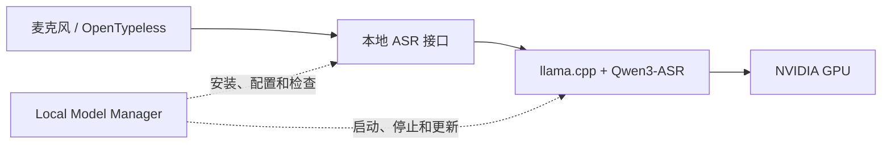

# 从本地显卡到日常语音输入：为什么做这个工具

[返回首页](../README.md) · [English](why-local-model-manager.en.md)

## 使用场景

电脑已经有一张 NVIDIA 显卡，希望在写代码、回复消息、整理文档时，用 OpenTypeless 把说话内容变成文字。语音识别希望运行在自己的 Windows 电脑上，便于控制模型、服务和音频数据的去向。

这个项目最初就是围绕 **Windows + RTX 5060 8GB + Qwen3-ASR + OpenTypeless** 的实际使用过程开发的。

## 遇到的问题

能下载模型，并不等于能方便地每天使用：

| 问题 | 使用时的表现 | 本项目的处理方式 |
| --- | --- | --- |
| 运行环境、CUDA 和模型分散 | 不知道下载哪个包，也不确定模型有没有用到显卡 | 单独管理 llama.cpp CUDA 运行环境，提供 Qwen3-ASR 引导安装和 GPU 状态 |
| 模型有配套文件 | 只有主 GGUF，遗漏 MMProj，服务无法正常工作 | 下载时检查配套文件，保存模型版本和校验信息 |
| 每次使用都要启动命令行 | 参数、端口和文件路径难记，关窗口后不清楚服务是否还在 | 用模型配置保存参数，支持启动、停止、重启、托盘操作 |
| 进程存在，但接口未就绪 | 输入软件连接后报错或没有识别结果 | 检查健康状态、实际模型 ID 和 ASR 路由，界面显示是否就绪 |
| 不知道如何连接 OpenTypeless | Base URL、Model ID、API Key 容易填错 | 显示当前服务的连接信息，支持复制并先测试真实麦克风 |
| 识别结果带协议前缀 | 文字前出现 `language Chinese<asr_text>` | 可选兼容代理只清理已识别的前缀，保留识别正文 |
| 更新怕覆盖配置或模型 | 重新解压后担心丢数据，或者新运行环境不可用 | 应用、运行环境和模型分别管理，更新校验并保留回滚记录 |
| 英文工具不便于日常使用 | 设置为中文，但页面仍是英文 | 简体中文与英文界面即时切换，保留日志和输入内容原文 |

## 解决思路

Local Model Manager 是本地模型服务的桌面管理器。OpenTypeless 继续负责录音快捷键、输入到其他应用等前端交互；Qwen3-ASR 负责识别音频；llama.cpp 负责运行模型。

如需清理 Qwen 格式前缀，可以在 OpenTypeless 与 ASR 服务之间启用本地兼容代理。它不做文字润色，也不调用云端大模型。

## 实际操作

1. 从 [Releases](https://github.com/Cdners/LocalModelManager/releases/latest) 下载 Windows x64 ZIP，完整解压到可写目录，运行 `LocalModelManager.exe`。
2. 在「概览」点击安装 Qwen3 ASR，等待 CUDA 运行环境、Q8_0 模型和 MMProj 下载、校验完成。
3. 启动模型，等待就绪状态。显存占用是整张显卡的数据，也包含其他应用。
4. 在「语音输入」先做一次麦克风测试，确认能得到识别结果。
5. 把页面显示的 Base URL 和实际 Model ID 复制到 OpenTypeless 的 Local / Custom Whisper 配置。本地接口不要求 API Key。
6. 若结果包含上述前缀，停止服务，在模型配置的高级选项开启兼容代理，再启动并复制新的地址。
7. 回到平时使用的编辑器或聊天软件，测试 OpenTypeless 的录音与文字插入。

完成模型下载后，ASR 推理在本机运行。OpenTypeless 的文字润色、翻译等其他功能是否访问云端，取决于它自身的配置；本工具不会替你修改这些选项。

## 已验证与边界

开发过程中已在 RTX 5060 8GB 上验证 Qwen3-ASR-1.7B Q8_0、真实麦克风转写以及 OpenTypeless 本地识别和文字插入。0.2.0 通过 35 项自动测试，并验证了中文、英文切换和 Windows 窗口唤出。

这些是单机验证结果，不代表所有驱动、显卡或模型组合都兼容。8GB 显卡仍需留出足够可用显存；首次安装需要访问 GitHub 和 Hugging Face。软件主要面向 Windows x64 与 NVIDIA CUDA，不包含模型文件，不提供聊天界面，也不代替 OpenTypeless 的完整功能。

本项目独立开发，与 OpenTypeless、Qwen、llama.cpp 及其维护方没有隶属关系。
